# Examen-Requetes-SQL

## Requête 1
**Nom et année de naissance des artistes nés avant 1950**

```sql
select nom, prénom, annéeNaiss from artiste where annéeNaiss < 1950;
```

**Explication**:  
j’ai utilisé SELECT nom, prénom, annéeNaiss pour récupérer uniquement les colonnes du nom, prénom et année de naissance des artistes, car ce sont les informations demandées. J’ai choisi la table artiste avec FROM artiste parce qu’elle contient les données sur les artistes, avec leur année de naissance. Pour filtrer les artistes nés avant 1950, j’ai ajouté WHERE annéeNaiss < 1950, qui permet de limiter les résultats aux lignes où l’année de naissance est strictement inférieure à 1950. J’ai terminé la requête avec un point-virgule ; car c’est obligatoire en SQL pour indiquer la fin de la requête.

**Capture d'écran**:  
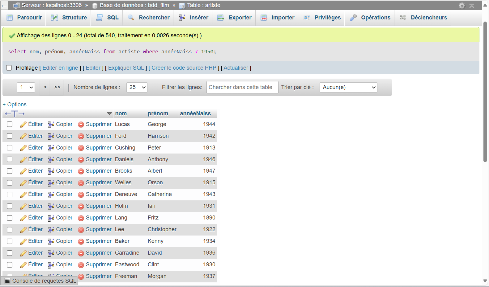

---

## Requête 2
**Titre de tous les drames**

```sql
select titre from film where genre='Drame';
```

**Explication**:  
j’ai utilisé SELECT titre pour récupérer uniquement la colonne titre des films puuisque la question demande seulement les titres. J’ai ciblé la table film avec FROM film parce qu’elle contient les informations sur les films et leur genre. Pour récupérer que les drames,j’ai ajouté WHERE genre = 'Drame' pour filtrer les films dont le genre est exactement "drame". Le point-virgule ; à la fin est essentiel pour que la requête soit valide

**Capture d'écran**:  
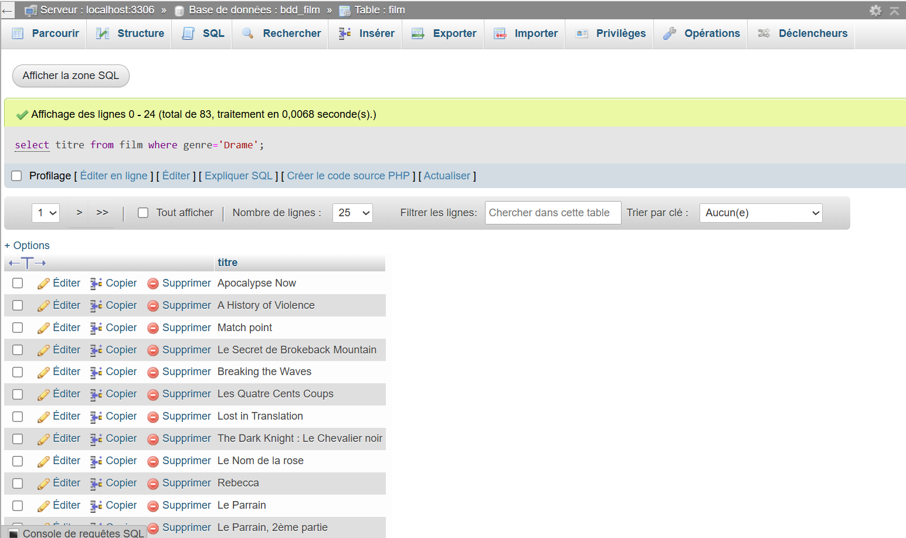

---

## Requête 3
**Quels rôles a joué Bruce Willis**

```sql
select nomRôle from role join artiste on role.idActeur= artiste.idArtiste where artiste.nom= 'Willis' and artiste.prénom= 'Bruce';
```

**Explication**:  
Pour cette requête, j’ai utilisé SELECT nomRôle pour récupérer les noms des rôles joués par Bruce Willis puisque c’est ce que la question demande. J’ai ciblé la table role avec FROM role car elle contient les informations sur les rôles. Comme je dois identifier Bruce Willis, j’ai joint la table artiste avec **JOIN artiste ON role.idActeur = artiste.idArtiste pour relier les acteurs aux rôles via leur idArtiste**, et pour m’assurer de ne récupérer que les rôles de Bruce Willis, j’ai ajouté WHERE artiste.nom = 'Willis' AND artiste.prénom = 'Bruce' pour filtrer sur son nom et prénom. Le point-virgule ; termine la requête.

**Capture d'écran**:  
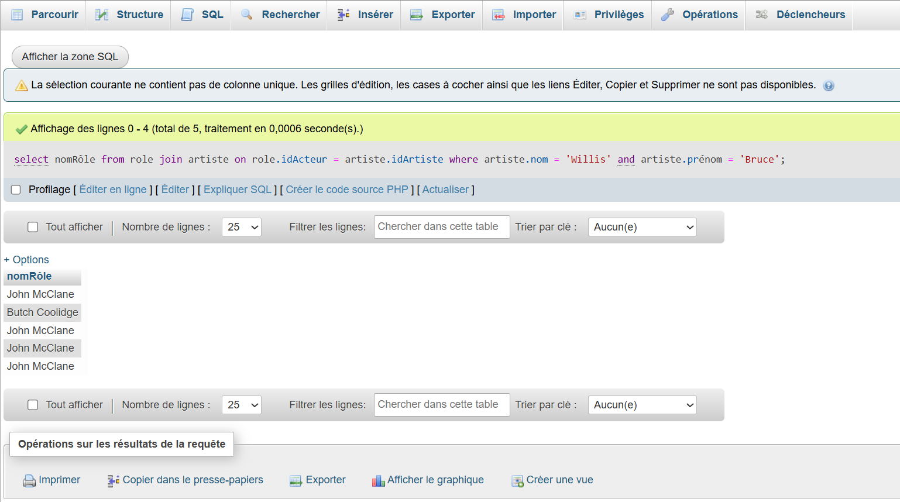

---

## Requête 4
**Qui est le réalisateur de Memento**

```sql
select artiste.nom, artiste.prénom from film join artiste on film.idRéalisateur= artiste.idArtiste where film.titre = 'Memento';
```

**Explication**:  
J’ai utilisé SELECT artiste.nom, artiste.prénom pour récupérer le nom et le prénom du réalisateur, car c’est ce qui est demandé. J’ai ciblé la table film avec FROM film car elle contient les informations sur les films, avec le titre et l’ID du réalisateur. Pour obtenir le nom du réalisateur, j’ai joint la table artiste avec **JOIN artiste ON film.idRéalisateur = a.idArtiste pour relier l’ID du réalisateur au nom et prénom de l’artiste**. J’ai filtré sur le film Memento avec WHERE film.titre = 'Memento'. Le point-virgule ; est indispensable à la fin pour que la requête soit valide.

**Capture d'écran**:  
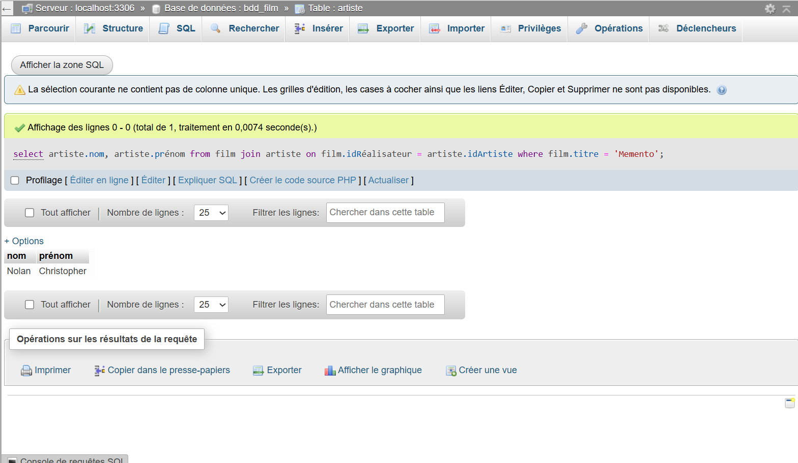

---

## Requête 5
**Quelles sont les notes obtenues par le film Fargo**

```sql
select notation.note from notation join film on notation.idFilm = film.idFilm where film.titre = 'Fargo';
```

**Explication**:  
Pour récupérer les notes du film Fargo, j’ai utilisé SELECT notation.note pour sélectionner la colonne des notes dans la table notation. J’ai ciblé la table notation avec FROM notation car elle contient les notes attribuées aux films. Comme je dois identifier le film Fargo, j’ai joint la table film avec **JOIN film ON notation.idFilm = film.idFilm pour relier les notes aux films via leur idFilm**. J’ai filtré sur Fargo avec WHERE film.titre = 'Fargo'. J’ai ajouté un point-virgule ; à la fin, car sans lui, la requête ne serait pas exécutée correctement.

**Capture d'écran**:  
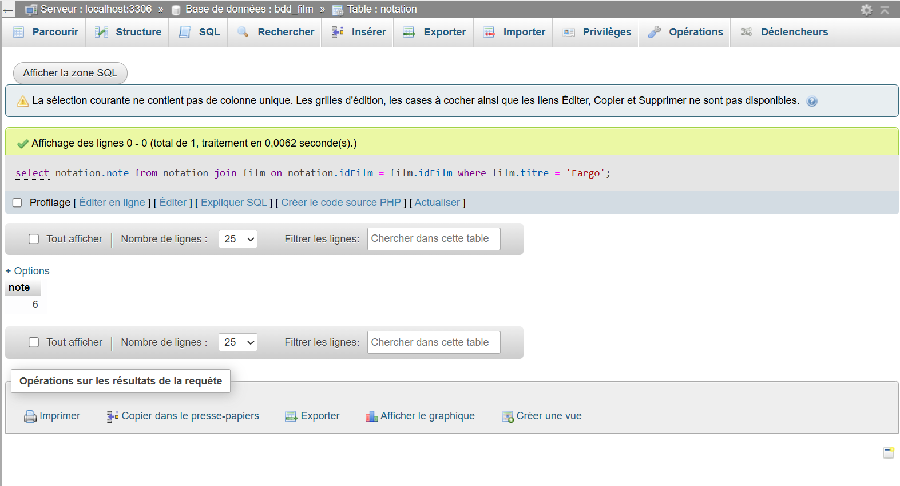

---

## Requête 6
**Qui a joué le rôle de Chewbacca**

```sql
select artiste.nom, artiste.prénom from role join artiste on role.idActeur = artiste.idArtiste where role.nomRôle = 'Chewbacca';
```

**Explication**:  
J’ai utilisé SELECT artiste.nom, artiste.prénom pour récupérer le nom et le prénom de l’acteur qui a joué Chewbacca. J’ai ciblé la table role avec FROM role car elle contient les informations sur les rôles et les acteurs associés. Pour obtenir le nom de l’acteur, j’ai joint la table artiste avec **JOIN artiste a ON role.idActeur = artiste.idArtiste pour relier l’ID de l’acteur au nom et prénom**. J’ai filtré sur le rôle de Chewbacca avec WHERE role.nomRôle = 'Chewbacca'. Le point-virgule ; est pour terminer la requête et éviter une erreur.

**Capture d'écran**:  
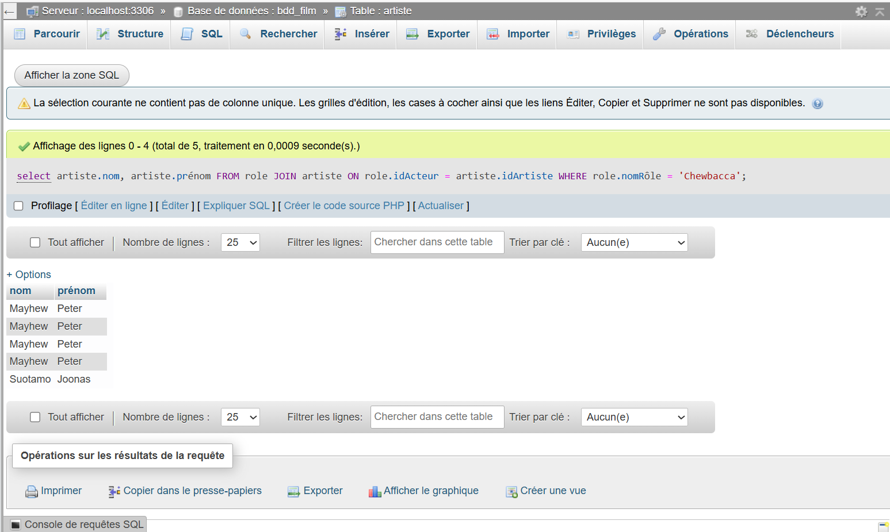

---

## Requête 7
**Dans quels films Bruce Willis a-t-il joué le rôle de John McClane**

```sql
select film.titre from role join film on role.idFilm = film.idFilm join artiste on role.idActeur = artiste.idArtiste where artiste.nom = 'Willis' and artiste.prénom = 'Bruce' and role.nomRôle = 'John McClane';
```

**Explication**:  
Pour cette requête, j’ai utilisé SELECT film.titre pour récupérer les titres des films où Bruce Willis a joué le rôle de John McClane. J’ai ciblé la table role avec FROM role car elle contient les informations sur les rôles, les acteurs et les films. J’ai joint la table film avec **JOIN film ON role.idFilm = film.idFilm pour obtenir les titres des films**, et la table artiste avec **JOIN artiste ON role.idActeur = artiste.idArtiste pour identifier Bruce Willis**. J’ai filtré avec WHERE artiste.nom = 'Willis' AND artiste.prénom = 'Bruce' AND role.nomRôle = 'John McClane' pour ne récupérer que les films où Bruce Willis joue ce rôle spécifique. Le point-virgule ; termine la requête.

**Capture d'écran**:  
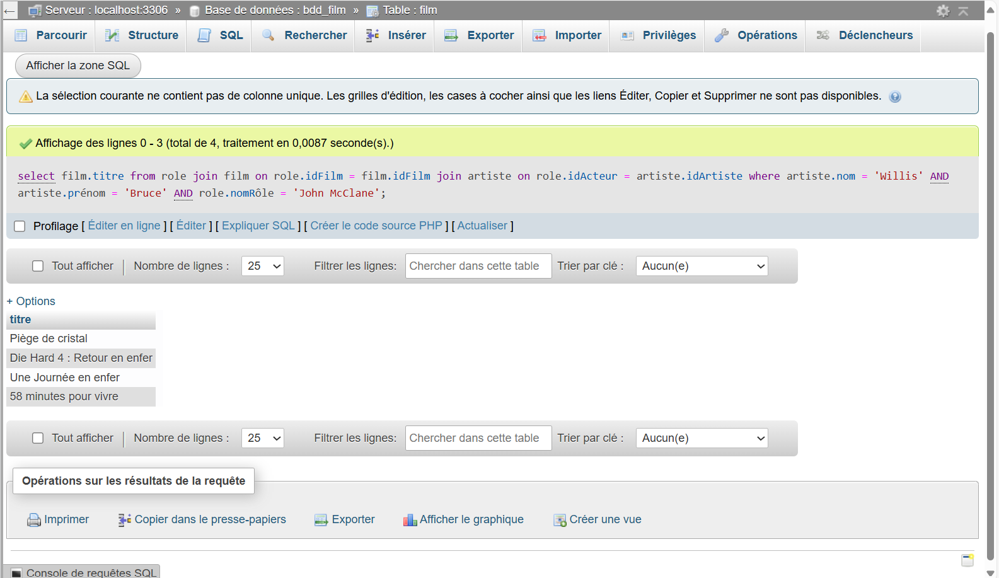

---

## Requête 8
**Nom des acteurs de Sueurs froides**

```sql
select a.nom, a.prénom from role r join artiste a on r.idActeur = a.idArtiste join film f on r.idFilm = f.idFilm where f.titre = 'Sueurs froides';
```

**Explication**:  
J’ai utilisé SELECT a.nom, a.prénom pour récupérer les noms et prénoms des acteurs du film Sueurs froides. J’ai ciblé la table role avec FROM role r (r por simplifier l'écriture après) car elle relie les acteurs aux films via les rôles. J’ai joint la table artiste avec **JOIN artiste a ON r.idActeur = a.idArtiste pour obtenir les noms des acteurs**, et la table film avec **JOIN film f ON r.idFilm = f.idFilm pour identifier le film**. J’ai filtré sur Sueurs froides avec WHERE f.titre = 'Sueurs froides'. Le point-virgule ; est ajouté à la fin pour que la requête soit valide.

**Capture d'écran**:  
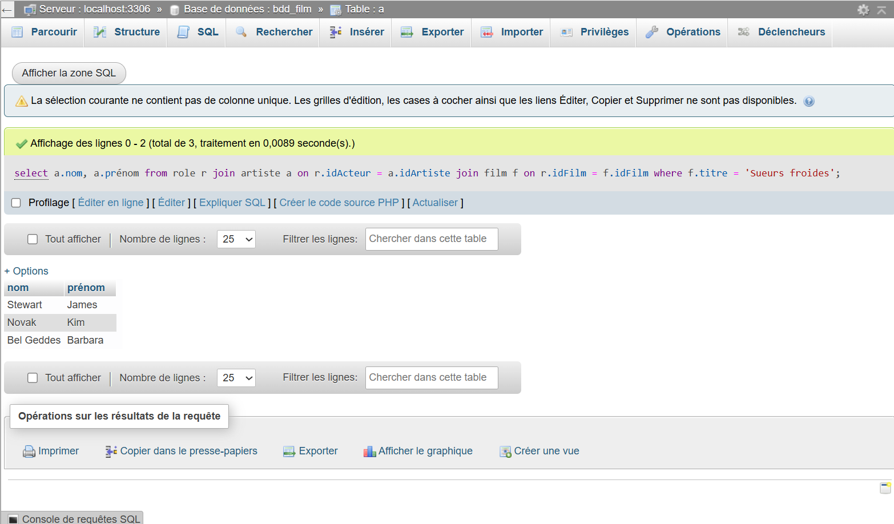

---

## Requête 9
**Quelles sont les films notés par l'internaute Prénom0 Nom0**

```sql
select f.titre from notation n join film f on n.idFilm = f.idFilm join internaute i on n.email = i.email where i.prénom = 'Prénom0' and i.nom = 'Nom0';
```

**Explication**:  
Pour récupérer les films notés par l’internaute Prénom0 Nom0, j’ai utilisé SELECT f.titre pour sélectionner les titres des films. J’ai ciblé la table notation avec FROM notation n car elle contient les notes associées aux films et aux internautes. J’ai joint la table film avec **JOIN film f ON n.idFilm = f.idFilm pour obtenir les titres**, et la table internaute avec **JOIN internaute i ON n.email = i.email pour identifier l’internaute**. J’ai filtré avec WHERE i.prénom = 'Prénom0' AND i.nom = 'Nom0' pour ne récupérer que les films notés par cet internaute. Le point-virgule ; est nécessaire pour terminer la requête.

**Capture d'écran**:  
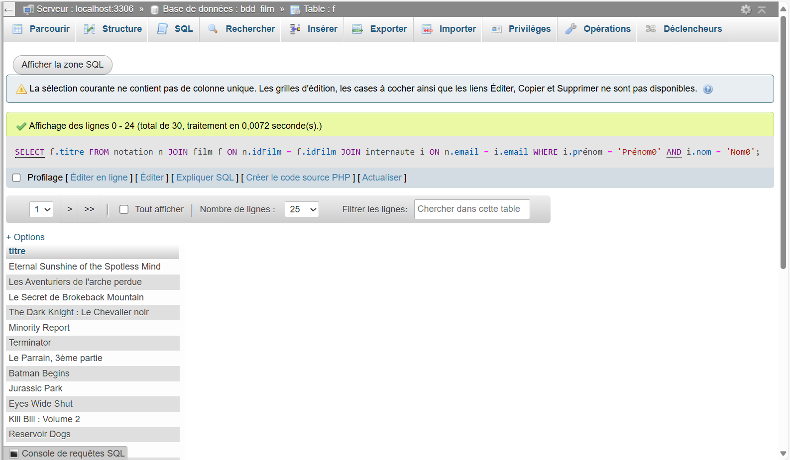

---

## Requête 10
**Films dont le réalisateur est Tim Burton, et l’un des acteurs Johnny Depp**

```sql
select f.titre from film f join role r on f.idFilm = r.idFilm join artiste a1 on r.idActeur = a1.idArtiste join artiste a2 on f.idRéalisateur = a2.idArtiste where a2.nom = 'Burton' and a2.prénom = 'Tim' and a1.nom = 'Depp' and a1.prénom = 'Johnny';
```

**Explication**:  
J’ai utilisé SELECT f.titre pour récupérer les titres des films. J’ai ciblé la table film avec FROM film f car elle contient les informations sur les films et les réalisateurs. J’ai joint la table role avec **JOIN role r ON f.idFilm = r.idFilm pour accéder aux acteurs**, et **j'ai joint la table artiste deux fois : une fois pour les acteurs avec JOIN artiste a1 ON r.idActeur = a1.idArtiste, et une fois pour le réalisateur avec JOIN artiste a2 ON f.idRéalisateur = a2.idArtiste**. J’ai filtré avec WHERE a2.nom = 'Burton' AND a2.prénom = 'Tim' AND a1.nom = 'Depp' AND a1.prénom = 'Johnny' pour ne récupérer que les films où Tim Burton est le réalisateur et Johnny Depp un acteur. Le point-virgule ; termine la requête pour qu’elle soit valide.

**Capture d'écran**:  
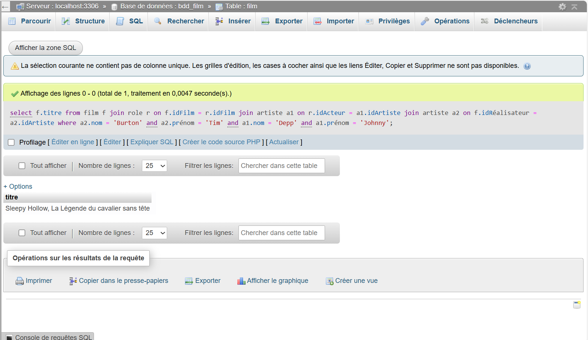

---

## Requête 11
**Titre des films dans lesquels a joué Woody Allen. Donner aussi le rôle**

```sql
select f.titre, r.nomRôle from role r join film f on r.idFilm = f.idFilm join artiste a on r.idActeur = a.idArtiste where a.nom = 'Allen' and a.prénom = 'Woody';
```

**Explication**:  
J’ai utilisé SELECT f.titre, r.nomRôle pour récupérer les titres des films et les rôles joués par Woody Allen. J’ai ciblé la table role avec FROM role r car elle contient les informations sur les rôles et les films. J’ai joint la table film avec **JOIN film f ON r.idFilm = f.idFilm pour obtenir les titres**, et la table artiste avec **JOIN artiste a ON r.idActeur = a.idArtiste pour identifier Woody Allen**. J’ai filtré avec WHERE a.nom = 'Allen' AND a.prénom = 'Woody' pour ne récupérer que ses rôles. Le point-virgule ; est indispensable pour que la requête s’exécute.

**Capture d'écran**:  
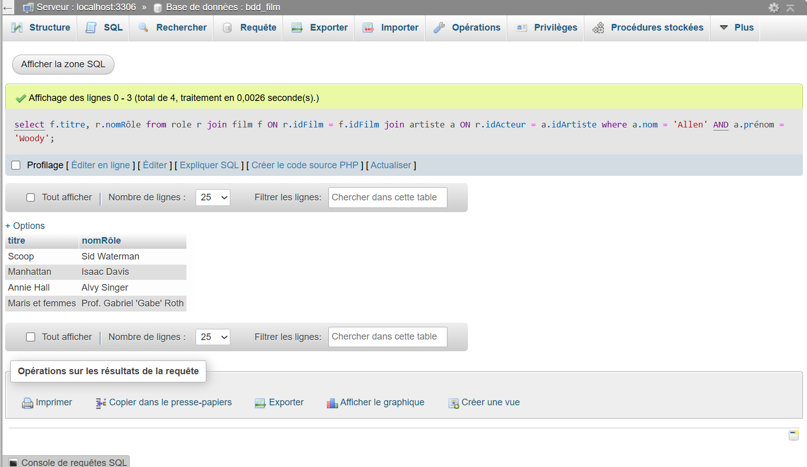

---

## Requête 12
**Quel metteur en scène a tourné dans ses propres films ? Donner le nom, le rôle et le titre des films**

```sql
select a.nom, a.prénom, r.nomRôle, f.titre from film f join role r on f.idFilm = r.idFilm join artiste a on r.idActeur = a.idArtiste where f.idRéalisateur = a.idArtiste;
```

**Explication**:  
J’ai utilisé SELECT a.nom, a.prénom, r.nomRôle, f.titre pour récupérer le nom, prénom, rôle et titre des films pour les réalisateurs ayant joué dans leurs propres films. J’ai ciblé la table film avec FROM film f car elle contient les informations sur les films et les réalisateurs. J’ai joint la table role avec **JOIN role r ON f.idFilm = r.idFilm pour accéder aux rôles**, et la table artiste avec **JOIN artiste a ON r.idActeur = a.idArtiste pour obtenir les noms des acteurs**. J’ai filtré avec WHERE f.idRéalisateur = a.idArtiste pour m’assurer que le réalisateur est aussi un acteur dans le film. Le point-virgule ; termine la requête pour qu’elle soit valide.

**Capture d'écran**:  
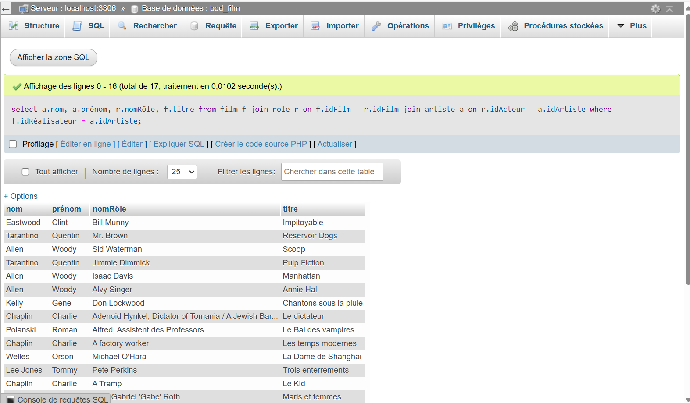

---

## Requête 13
**Titre des films de Quentin Tarantino dans lesquels il n’a pas joué**

```sql
select f.titre from film f join artiste a on f.idRéalisateur = a.idArtiste where a.nom = 'Tarantino' and a.prénom = 'Quentin' and f.idFilm not in ( select r.idFilm from role r where r.idActeur = a.idArtiste );
```

**Explication**:  
J’ai utilisé SELECT f.titre pour récupérer les titres des films réalisés par Quentin Tarantino où il n’a pas joué. J’ai ciblé la table film avec FROM film f car elle contient les films et leurs réalisateurs. J’ai joint la table artiste avec **JOIN artiste a ON f.idRéalisateur = a.idArtiste pour identifier Quentin Tarantino**. J’ai filtré avec WHERE a.nom = 'Tarantino' AND a.prénom = 'Quentin' pour ne récupérer que ses films. Pour exclure les films où il a joué, j’ai utilisé AND f.idFilm NOT IN avec une sous-requête **(SELECT r.idFilm FROM role r WHERE r.idActeur = a.idArtiste) qui liste les films où il est acteur**. Le point-virgule ; est nécessaire pour terminer la requête.

**Capture d'écran**:  
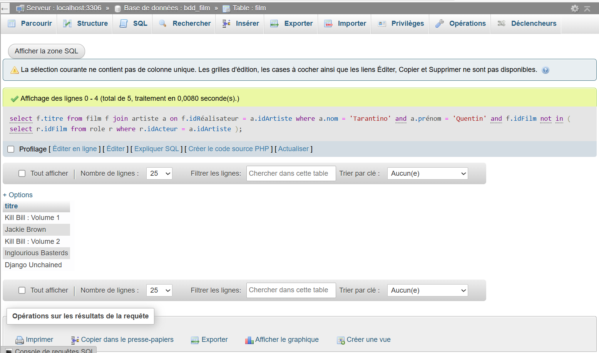

---

## Requête 14
**Quel metteur en scène a tourné en tant qu’acteur ? Donner le nom, le rôle et le titre des films dans lesquels cet artiste a joué**

```sql
select distinct a.nom, a.prénom, r.nomRôle, f.titre from role r join artiste a on r.idActeur = a.idArtiste join film f on r.idFilm = f.idFilm where a.idArtiste in ( select idRéalisateur from film );
```

**Explication**:  
J’ai utilisé SELECT DISTINCT a.nom, a.prénom, r.nomRôle, f.titre pour récupérer les noms, prénoms, rôles et titres des films pour les réalisateurs ayant joué en tant qu’acteurs, avec DISTINCT pour éviter les doublons. J’ai ciblé la table role avec FROM role r car elle contient les rôles joués. J’ai joint la table artiste avec **JOIN artiste a ON r.idActeur = a.idArtiste pour obtenir les noms**, et la table film avec **JOIN film f ON r.idFilm = f.idFilm pour les titres**. J’ai filtré avec WHERE a.idArtiste IN **(SELECT idRéalisateur FROM film) pour ne récupérer que les artistes qui sont aussi réalisateurs**. Le point-virgule ; termine la requête pour qu’elle soit valide.

**Capture d'écran**:  
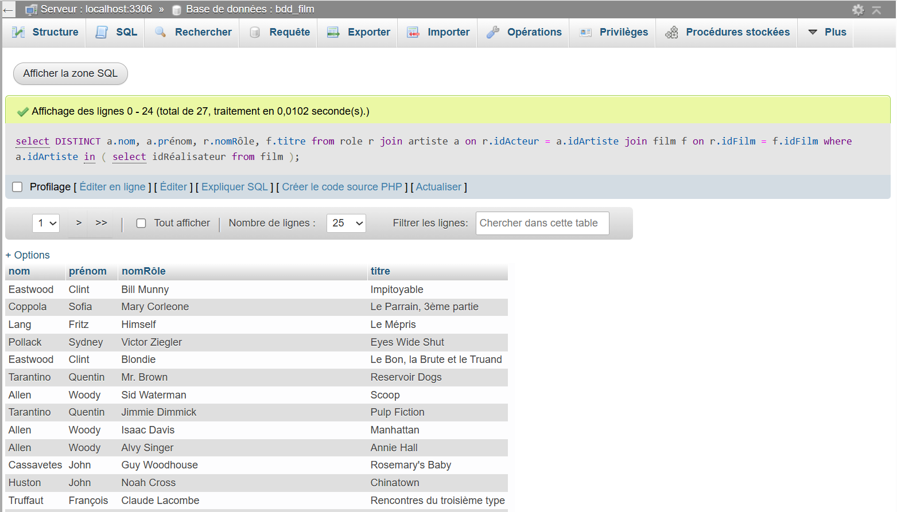

---

## Requête 15
**Donnez les films de Hitchcock sans James Stewart**

```sql
select f.titre from film f join artiste a on f.idRéalisateur = a.idArtiste where a.nom = 'Hitchcock' and a.prénom = 'Alfred' and f.idFilm not in ( select r.idFilm from role r join artiste a2 on r.idActeur = a2.idArtiste where a2.nom = 'Stewart' and a2.prénom = 'James' );
```

**Explication**:  
J’ai utilisé SELECT f.titre pour récupérer les titres des films réalisés par Alfred Hitchcock sans James Stewart. J’ai ciblé la table film avec FROM film f car elle contient les films et leurs réalisateurs. J’ai joint la table artiste avec **JOIN artiste a ON f.idRéalisateur = a.idArtiste pour identifier Hitchcock**. J’ai filtré avec WHERE a.nom = 'Hitchcock' AND a.prénom = 'Alfred' pour ne récupérer que ses films. **Pour exclure les films avec James Stewart, j’ai utilisé AND f.idFilm NOT IN avec une sous-requête (SELECT r.idFilm FROM role r JOIN artiste a2 ON r.idActeur = a2.idArtiste WHERE a2.nom = 'Stewart' AND a2.prénom = 'James') qui liste les films où James Stewart a joué**. Le point-virgule ; est requis pour valider la requête.

**Capture d'écran**:  
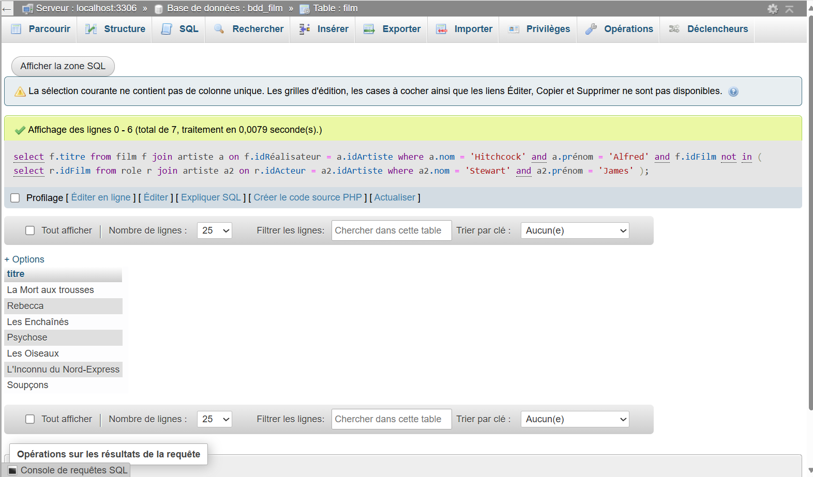

---

## Requête 16
**Dans quels films le réalisateur a-t-il le même prénom que l’un des interprètes ? (titre, nom du réalisateur, nom de l’interprète)**

```sql
select f.titre, a1.nom as nomRéalisateur, a1.prénom as prénomRéalisateur, a2.nom as nomActeur, a2.prénom as prénomActeur from film f join artiste a1 on f.idRéalisateur = a1.idArtiste join role r on f.idFilm = r.idFilm join artiste a2 on r.idActeur = a2.idArtiste where a1.prénom = a2.prénom and a1.idArtiste != a2.idArtiste;
```

**Explication**:  
J’ai utilisé SELECT f.titre, a1.nom AS nomRéalisateur, a1.prénom AS prénomRéalisateur, a2.nom AS nomActeur, a2.prénom AS prénomActeur pour récupérer le titre du film, le nom et prénom du réalisateur, et le nom et prénom de l’acteur ayant le même prénom. J’ai ciblé la table film avec FROM film f pour les films. **J’ai joint la table artiste pour le réalisateur avec JOIN artiste a1 ON f.idRéalisateur = a1.idArtiste**, j'ai joint la table role avec **JOIN role r ON f.idFilm = r.idFilm pour les acteurs**, **et à nouveau artiste pour les acteurs avec JOIN artiste a2 ON r.idActeur = a2.idArtiste**. J’ai filtré avec WHERE a1.prénom = a2.prénom AND **a1.idArtiste != a2.idArtiste pour m’assurer que le prénom est le même mais que ce n’est pas la même personne**. Le point-virgule ; termine la requête.

**Capture d'écran**:  
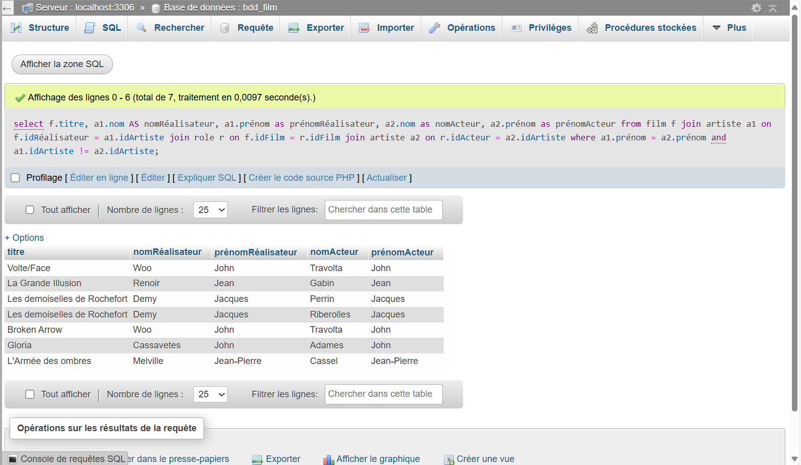

---

## Requête 17
**Les films sans rôle**

```sql
select f.titre from film f left join role r on f.idFilm = r.idFilm where r.idFilm is null;
```

**Explication**:  
J’ai utilisé SELECT f.titre pour récupérer les titres des films qui n’ont aucun rôle. J’ai ciblé la table film avec FROM film f car elle contient tous les films. J’ai utilisé une jointure gauche avec **LEFT JOIN role r ON f.idFilm = r.idFilm pour inclure tous les films, même ceux sans rôles**. J’ai filtré avec WHERE r.idFilm **IS NULL pour ne récupérer que les films où aucun rôle n’est associé** (ceux où la jointure n’a rien renvoyé). Le point-virgule ; est nécessaire pour que la requête soit valide.

**Capture d'écran**:  
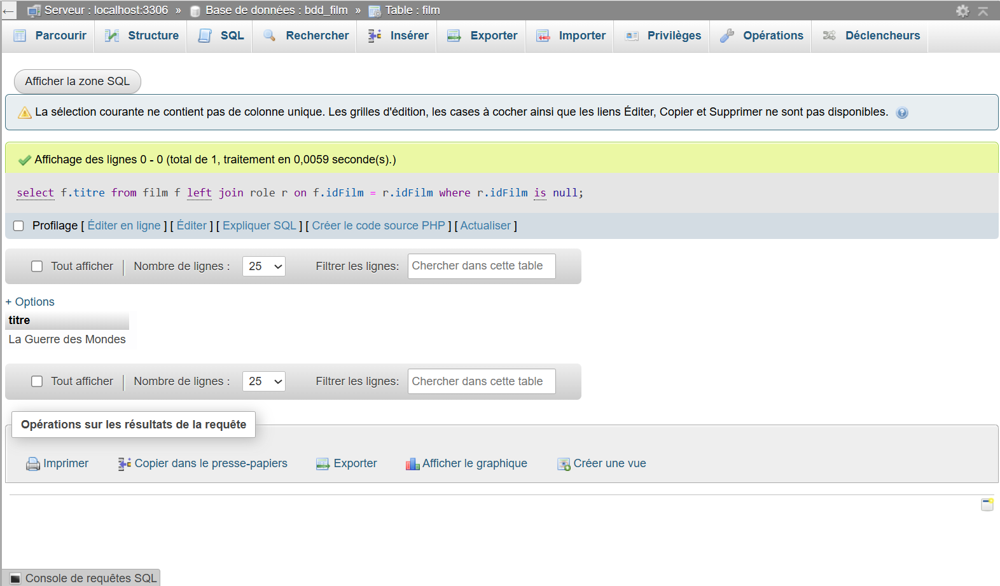

---

## Requête 18
**Quelles sont les films non notés par l'internaute Prénom1 Nom1**

```sql
select f.titre from film f where f.idFilm not in ( select n.idFilm from notation n join internaute i on n.email = i.email where i.prénom = 'Prénom1' and i.nom = 'Nom1' );
```

**Explication**:  
J’ai utilisé SELECT f.titre pour récupérer les titres des films non notés par l’internaute Prénom1 Nom1. J’ai ciblé la table film avec FROM film f car elle contient tous les films. **Pour exclure les films notés par cet internaute, j’ai utilisé WHERE f.idFilm NOT IN avec une sous-requête (SELECT n.idFilm FROM notation n JOIN internaute i ON n.email = i.email WHERE i.prenom = 'Prénom 1' AND i.nom = 'Nom1') qui liste les films notés par Prénom1 Nom1**. Le point-virgule ; termine la requête pour qu’elle soit valide.

**Capture d'écran**:  
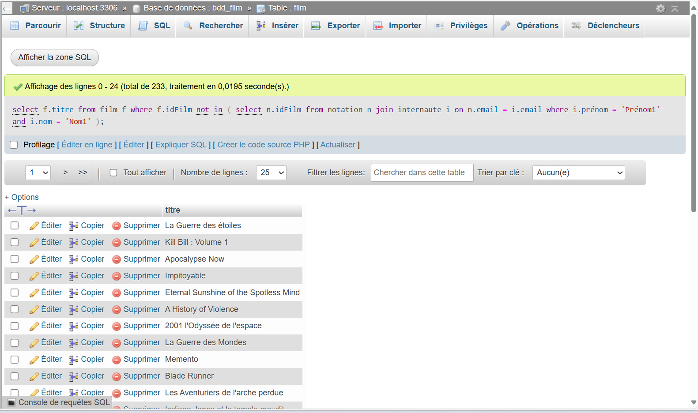

---

## Requête 19
**Quels acteurs n’ont jamais réalisé de film**

```sql
select distinct a.nom, a.prénom from role r join artiste a on r.idActeur = a.idArtiste where a.idArtiste not in ( select idRéalisateur from film );
```

**Explication**:  
J’ai utilisé SELECT DISTINCT a.nom, a.prénom pour récupérer les noms et prénoms des acteurs qui n’ont jamais réalisé de film, avec DISTINCT pour éviter les doublons. J’ai ciblé la table role avec FROM role r car elle contient les acteurs. J’ai joint la table artiste avec **JOIN artiste a ON r.idActeur = a.idArtiste pour obtenir leurs noms**. J’ai filtré avec WHERE a.idArtiste **NOT IN (SELECT idRéalisateur FROM film) pour exclure les artistes qui ont réalisé des films**. Le point-virgule ; est requis pour valider la requête.

**Capture d'écran**:  
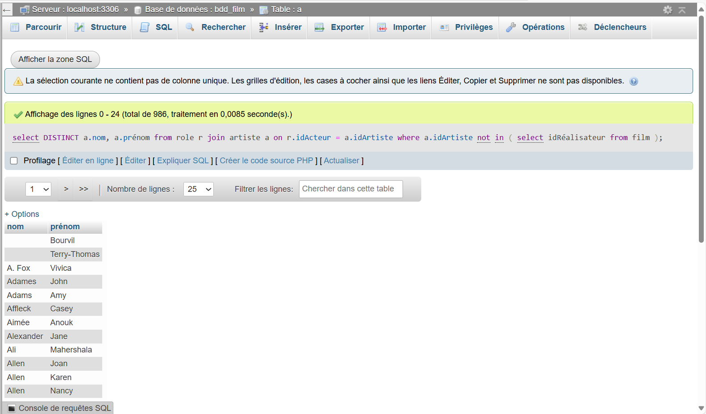

---

## Requête 20
**Quelle est la moyenne des notes de Memento**

```sql
select avg(n.note) as moyenne from notation n join film f on n.idFilm = f.idFilm where f.titre = 'Memento';
```

**Explication**:  
J’ai utilisé SELECT AVG(n.note) AS moyenne pour calculer la moyenne des notes du film Memento, avec AVG pour faire la moyenne et AS moyenne pour nommer la colonne résultat. J’ai ciblé la table notation avec FROM notation n car elle contient les notes. J’ai joint la table film avec **JOIN film f ON n.idFilm = f.idFilm pour identifier Memento**. J’ai filtré avec WHERE f.titre = 'Memento' pour ne considérer que ce film. Le point-virgule ; termine la requête pour qu’elle soit valide.

**Capture d'écran**:  
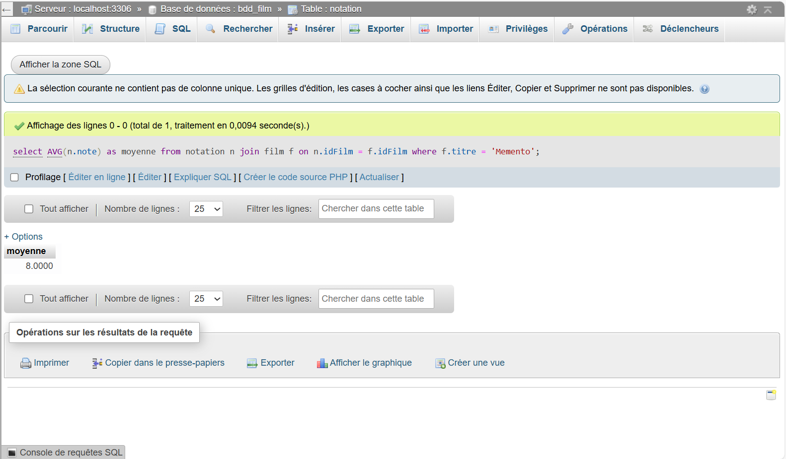

---

## Requête 21
**id, nom et prénom des réalisateurs, et nombre de films qu’ils ont tournés**

```sql
select a.idArtiste, a.nom, a.prénom, count(f.idFilm) as nombreFilms from artiste a left join film f on a.idArtiste = f.idRéalisateur group by a.idArtiste, a.nom, a.prénom;
```

**Explication**:  
J’ai utilisé SELECT a.idArtiste, a.nom, a.prénom, COUNT(f.idFilm) AS nombreFilms pour récupérer l’ID, le nom, le prénom des réalisateurs et le nombre de films qu’ils ont tournés, avec **COUNT pour compter les films** et AS nombreFilms pour nommer la colonne. J’ai ciblé la table artiste avec FROM artiste a pour inclure tous les artistes. J’ai utilisé une jointure gauche avec **LEFT JOIN film f ON a.idArtiste = f.idRéalisateur pour inclure même les artistes sans films** (où le compte sera 0). **J’ai regroupé les résultats avec GROUP BY a.idArtiste, a.nom, a.prénom pour compter les films par réalisateur**. Le point-virgule ; est nécessaire pour valider la requête.

**Capture d'écran**:  
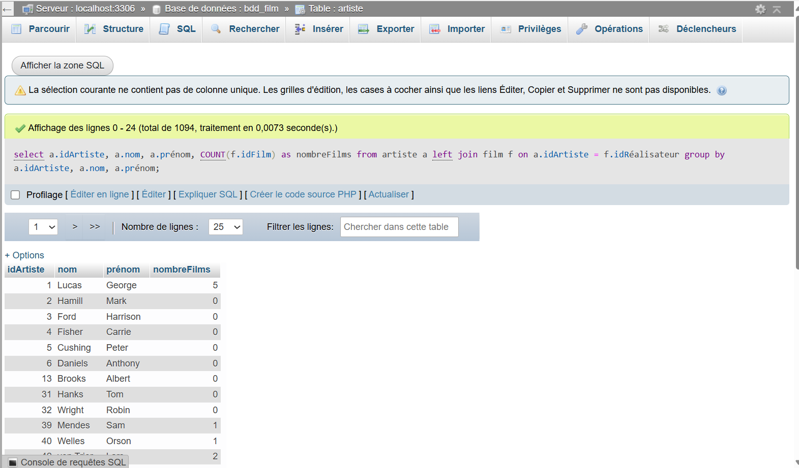

---

## Requête 22
**Nom et prénom des réalisateurs qui ont tourné au moins deux films**

```sql
select a.nom, a.prénom from artiste a join film f on a.idArtiste = f.idRéalisateur group by a.idArtiste, a.nom, a.prénom having count(f.idFilm) >= 2;
```

**Explication**:  
J’ai utilisé SELECT a.nom, a.prénom pour récupérer les noms et prénoms des réalisateurs ayant tourné au moins deux films. J’ai ciblé la table artiste avec FROM artiste a et joint la table film avec **JOIN film f ON a.idArtiste = f.idRéalisateur pour accéder aux films**. **J’ai regroupé les résultats avec GROUP BY a.idArtiste, a.nom, a.prénom pour compter les films par réalisateur**. **J’ai filtré avec HAVING COUNT(f.idFilm) >= 2 pour ne garder que ceux avec au moins deux films**. Le point-virgule ; termine la requête pour qu’elle soit valide.

**Capture d'écran**:  
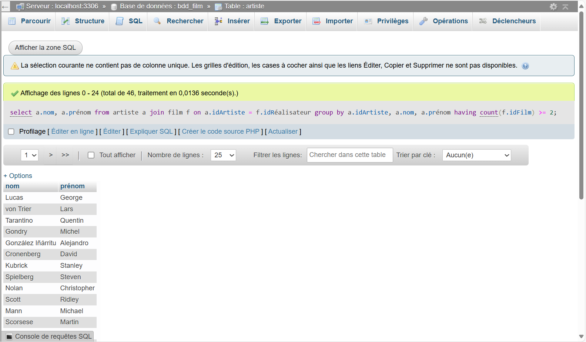

---

## Requête 23
**Quels films ont une moyenne des notes supérieure à 7**

```sql
select titre from notemoyenne where moyenne > 7;
```

**Explication**:  
J’ai utilisé SELECT titre pour récupérer les titres des films ayant une moyenne des notes supérieure à 7. J’ai ciblé la vue notemoyenne avec FROM notemoyenne car elle contient déjà les titres et les moyennes des notes calculées pour les films ayant une moyenne supérieure à 7. J’ai ajouté WHERE moyenne > 7 pour m’assurer que seuls ces films sont retournés, bien que la vue soit déjà filtrée ainsi. Le point-virgule ; est requis pour que la requête soit valide.

**Capture d'écran**:  
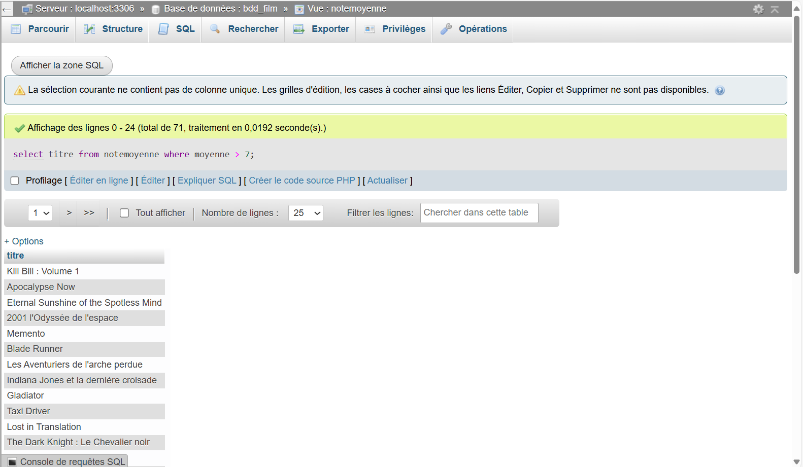

